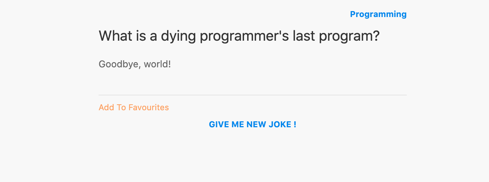
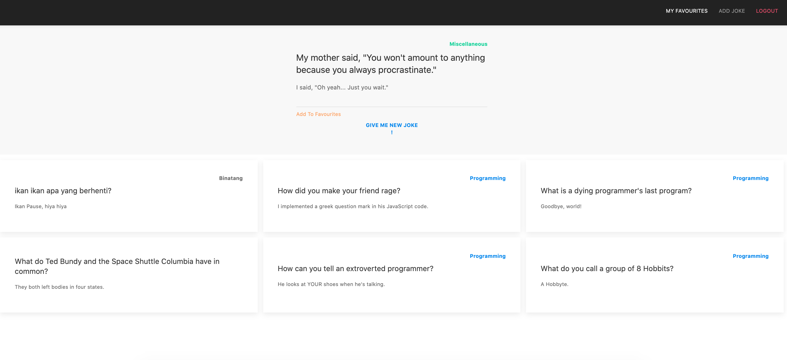
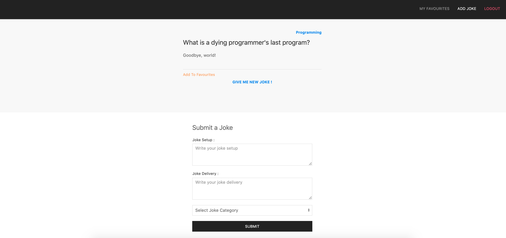

# Phase 2 - Live Code Final

## Hacktivjokes
Pada kali ini kalian akan membuat sebuah website tentang jokes, kita akan membuat fitur register (hanya server), signIn, create joke, show random joke, add joke to favourite, show favourite jokes. 

### Summary

- -20 tidak menggunakan sequelize n postgres atau tidak menggunakan project hasil vue cli
- -10 Tidak SPA 
- -20 push node module
- -20 tidak push package json
- -5 tidak memberikan environtment variables
- -10 using alert()

## Release 0 - Authentication

### Server - signUp
- Lakukan signUp sesuai api-doc

### Server - signIn
- Lakukan signIn sesuai api-doc

### Client - signIn & signOut
- jika sudah signin, kalau direfresh tidak harus signin lagi
- buatlah routing dan views untuk form signin
- jika signIn berhasil maka akan ke routing '/' yang akan menampilkan 1 random jokes dan joke favourite user yang sedang signIn (**namun karena kita belum ada data joke sama sekali, release 1 akan membahas add joke terlebih dahulu**)

NOTES: REGISTER CLIENT TIDAK PERLU ADA

Contoh halaman signIn (gambar ini hanya layout, jika kalian membuat lebih baik dan rapi sangat diperbolehkan): 

## Release 1 - Add Joke

### Server
- Lakukan Add Joke sesuai api-doc

### Client
- buatlah routing di client untuk menampilkan form add joke
- sesuaikan input dengan field jokes
- untuk category jokes berupa select list dengan isi : Programming, Dark, dan Miscellaneous

**Contoh halaman add jokes dapat dilihat di release 2**

## Release 2 - Fetch Random Joke && Fetch User favourite Joke

### Server
- Lakukan Fetch random joke sesuai api-doc
- Lakukan fetch user fav jokes sesuai api-doc

### Client
- Pada komponen random joke terdapat button add joke to favourite (release 3) dan give me a new joke (**jika di klik akan fetch random joke ke server lagi**)
s
Contoh halaman '/' atau halaman awal (gambar ini hanya layout, jika kalian membuat lebih baik dan rapi sangat diperbolehkan): 

- kesimpulan views dan routing client yang perlu dibuat : 
  1. halaman awal yang berisi joke favorite user
  2. halaman add joke yang berisi form add joke
  Sekarang Random joke akan bisa berada di kedua view tersebut
Contoh halaman '/' atau halaman awal (gambar ini hanya layout, jika kalian membuat lebih baik dan rapi sangat diperbolehkan): 

Contoh halaman '/addjoke' atau add joke (gambar ini hanya layout, jika kalian membuat lebih baik dan rapi sangat diperbolehkan): 

## Release 3 - Add Joke to favourites

### Server
- Lakukan add joke favourite seperti pada api-doc

### Client
- integrasi tombol tambah ke favourite di random joke yang muncul di halaman awal
- pastikan website kalian reaktif (jika berhasil menambah favourite maka list joke favourite user akan bertambah otomatis di client)